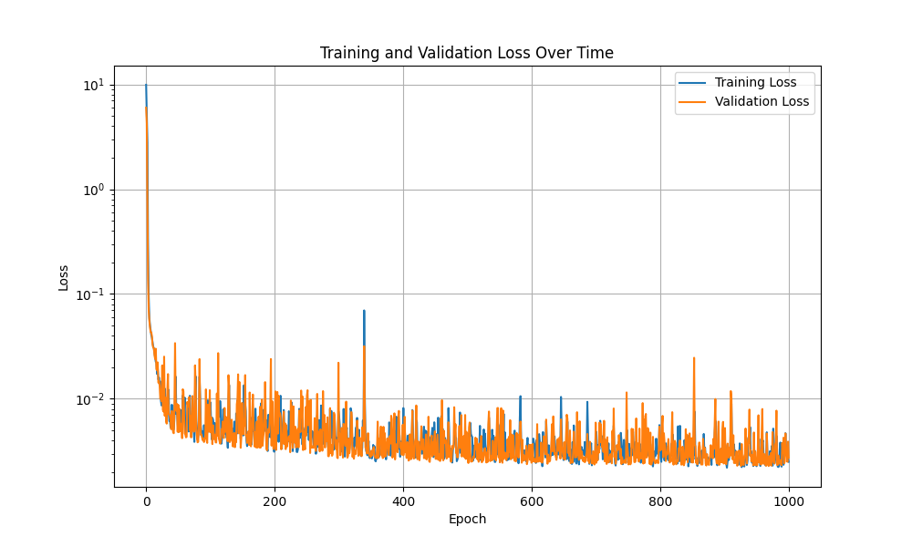
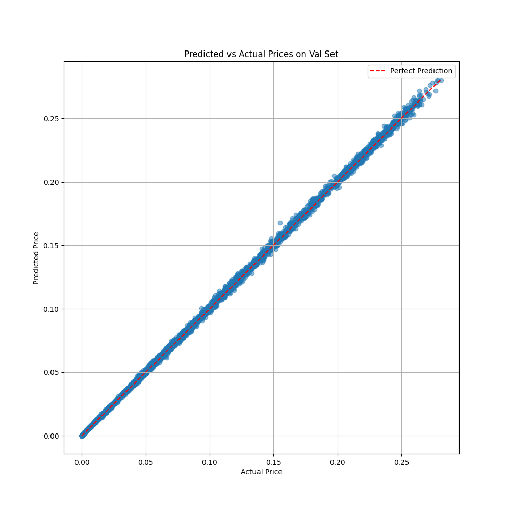

```mermaid
flowchart LR
    Input["Input<br>5 features"] --> H1["Hidden Layer 1<br>100 neurons<br>ReLU"]
    H1 --> H2["Hidden Layer 2<br>100 neurons<br>ReLU"]
    H2 --> H3["Hidden Layer 3<br>100 neurons<br>ReLU"]
    H3 --> H4["Hidden Layer 4<br>100 neurons<br>ReLU"]
    H4 --> OutputL["Output Layer<br>100 neuron<br> No ReLU"]
    OutputL --> n1["Price"]

    Input@{ shape: card}
    H1@{ shape: lean-r}
    H2@{ shape: lean-r}
    H3@{ shape: lean-r}
    H4@{ shape: lean-r}
    OutputL@{ shape: lean-r}
    n1@{ shape: card}
    style Input fill:#FFE0B2
    style H1 fill:#C8E6C9
    style H2 fill:#C8E6C9
    style H3 fill:#C8E6C9
    style H4 fill:#C8E6C9
    style OutputL fill:#BBDEFB
    style n1 fill:#E1BEE7
```

# CUDA Implementation of Nested Monte Carlo for Log-Variance-Gamma Model

A high-performance implementation of the Log-Variance-Gamma model using CUDA for accelerated Monte Carlo simulations, developed as part of the ENSAE GPU Programming course teached by [Lokmane Abbas Turki](https://www.ensae.fr/en/faculty/4113-lokmane-abbas-turki).

***

<div align="center">
  
  &nbsp;&nbsp;&nbsp;&nbsp;
  
</div>

***

## Overview

This project implements a nested Monte Carlo simulation for the Log-Variance-Gamma model using CUDA acceleration. It includes:

- Two efficient gamma variable generation algorithms:
  - Johnk's method
  - Best's method
- GPU-accelerated nested Monte Carlo simulation
- Neural network training using **PyTorch** for price approximation

## Project Structure

```plaintext
├── README.md
├── gamma-generators/          # Gamma distribution generators
│   ├── best.cu                # Best's method implementation
│   └── johnk.cu               # Johnk's method implementation
├── monte-carlo/               # Monte Carlo simulation
│   ├── simulation.cu          # Nested Monte Carlo implementation
│   └── data/
│       └── vg_prices_all.csv  # Generated dataset
└── pytorch/                   # Neural network implementation
    ├── train.py               # Training script
    └── model.py               # Neural network architecture
```

## Installation

1. Clone the repository:

```bash
git clone https://github.com/Matt-Olek/CUDA-Log-Variance-Gamma-model.git
cd CUDA-Log-Variance-Gamma-model
```

## Table of Contents

- [Gamma Distribution Generators](#gamma-distribution-generators)
- [Monte Carlo Simulation](#monte-carlo-simulation)
- [Neural Network Training](#neural-network-training)

***

## Gamma Distribution Generators

The `gamma-generators` folder contains two implementations of the gamma distribution generator:

- `best.cu`: Best's method
- `johnk.cu`: Johnk's method

They are both coded as `__device__` functions and can be called directly from the Monte Carlo simulation. **By default**, the `simulation.cu` file uses the **johnk**'s method. To use best's method, you can change the macro definition at the beginning of the file `simulation.cu` to `#define BEST_METHOD`.

## Monte Carlo Simulation

> I simulated 10 000 paths, each with 1000 steps across a grid of the following parameters:
>
> - **Time to maturity T**: [0.3, 0.5, 1.0, 2.0, 3.0]
> - **Strike price K**: [0.8, 0.9, 1.0, 1.1, 1.2]
> - **Volatility σ**: [0.10, 0.12, 0.13, 0.14, 0.15, 0.16, 0.17, 0.18, 0.19, 0.20]
> - **Mean reversion θ**: [-0.34, -0.30, -0.27, -0.24, -0.21, -0.25, -0.26, -0.35, -0.40, -0.45]
> - **Mean reversion speed κ**: [0.11, 0.12, 0.13, 0.14, 0.15, 0.16, 0.17, 0.18, 0.19, 0.20]

Which gives us a total of : $5 \times 5 \times 10 \times 10 \times 10 = 25000$ different parameters combinations.
When taking into account the number of paths, we get $25000 \times 10000 = 2.5 \times 10^8$ simulations, so a **quarter of a billion**.

Thats why we need to use GPU acceleration to make it feasible to compute it in a reasonable time.

My approach consisted in **parralelizing** the simulations across the different **parameters combinations** (and not the paths of the same simulation) as the Monte Carlo simulation is independent for each path.

As seen in the course, the best way to do it is to use the CUDA framework to store and index the different parameters combinations in the registers so that we can use the thread index to access the correct parameters. This is done in the following way:

### Memory Allocation and Indexing Strategy

The implementation I used uses an advanced memory allocation and indexing approach:

- Each thread handles **one** parameter **combination**, with the thread index decomposed into parameter indices using integer division
- Results are stored in a flat array with 2 values per combination (**moment of order 1 and 2**)
- This approach minimizes memory access patterns and maximizes parallelization efficiency

For example, to decompose a thread index into parameter indices:

```c
int idx = 1234; 
int t_idx = idx / (5 * 10 * 10 * 10);  // dim(K) * dim(kappa) * dim(theta) * dim(sigma)
idx -= t_idx * (5 * 10 * 10 * 10);
int k_idx = idx / (10 * 10 * 10);      // dim(kappa) * dim(theta) * dim(sigma)
idx -= k_idx * (10 * 10 * 10);
int kappa_idx = idx / (10 * 10);       // dim(theta) * dim(sigma)
idx -= kappa_idx * (10 * 10);
int theta_idx = idx / 10;              // sigma
int sigma_idx = idx % 10;              
```

This way, close index are stored close to each other in memory, minimizing the time of memory access.

Here's a visualization of how different thread indices map to parameter combinations:

| Parameter | Index 0 | Index 1 | Index 2 | Index 3 | Index 4 | Index 5 | Index 6 | Index 7 | Index 8 | Index 9 | Index 10 | Index 11 | ... | Index 100 | Index 101 | ... | Index 1000 | Index 1001 |
|-----------|---------|---------|---------|---------|---------|---------|---------|---------|---------|---------|----------|----------|-----|-----------|-----------|-----|------------|------------|
| T (5)     | 0.3     | 0.3     | 0.3     | 0.3     | 0.3     | 0.3     | 0.3     | 0.3     | 0.3     | 0.3     | 0.3      | 0.3      | ... | 0.3       | 0.3       | ... | 0.3        | 0.3        |
| K (5)     | 0.8     | 0.8     | 0.8     | 0.8     | 0.8     | 0.8     | 0.8     | 0.8     | 0.8     | 0.8     | 0.8      | 0.8      | ... | 0.8       | 0.8       | ... | **0.9**    | **0.9**    |
| κ (10)    | 0.11    | 0.11    | 0.11    | 0.11    | 0.11    | 0.11    | 0.11    | 0.11    | 0.11    | 0.11    | 0.11     | 0.11     | ... | **0.12**  | **0.12**  | ... | 0.11       | 0.11       |
| θ (10)    | -0.34   | -0.34   | -0.34   | -0.34   | -0.34   | -0.34   | -0.34   | -0.34   | -0.34   | -0.34   | **-0.30** | **-0.30** | ... | -0.34     | -0.34     | ... | -0.34      | -0.34      |
| σ (10)    | 0.10    | **0.12** | **0.13** | **0.14** | **0.15** | **0.16** | **0.17** | **0.18** | **0.19** | **0.20** | 0.10      | **0.12**  | ... | 0.10      | **0.12**  | ... | 0.10       | **0.12**   |

- σ changes every index (0-9)
- θ changes every 10 indices (10-19)
- κ changes every 100 indices (100-199)
- K changes every 1000 indices (1000-1999)
- T changes every 25000 indices

### Block Sizing Strategy

I used the following block sizing strategy to optimize GPU performance:

- Each thread processes one complete parameter combination (all trajectories for one set of parameters)
- Block size is set to 256 threads per block, its a bit arbitrary but it works well with the number of parameters and the number of paths on my GPU. We may be able to optimize it further.
- The total number of blocks is calculated dynamically based on the number of parameter combinations: `(total_combinations + threadsPerBlock - 1) / threadsPerBlock`

### Dataset Generation

1. Navigate to the Monte Carlo directory:

```bash
cd monte-carlo
```

2. Compile and run the simulation:

```bash
nvcc -o SIMULATION simulation.cu
./SIMULATION
```

The simulation will generate a csv file with the results in the `monte-carlo/data` directory. It will be later be used to train the neural network.

Performance results are saved in the `monte-carlo/data/execution_time.md` file and rendered below:
> 

### Neural Network Training

> For this project I used a simple **MLP with 4 hidden layers, and 1 output layer**.
> As the model is not very complex, we could have used a more fine-grained approach by using some skipped connections or batch normalization but I decided to keep it simple as the class is more about the GPU programming than the model design. The model can be found in the `pytorch/model.py` file and adapted freely.

***



***

Both the model and the training script are located in the `pytorch` directory. You can check the model in the `pytorch/model.py` file and the training script in the `pytorch/train.py` file.

1. Navigate to the PyTorch directory:

```bash
cd pytorch
```

2. Run the training script:

```bash
python train.py
```

The training script will:

- Generate training and validation loss plots
- Save the trained model in the `models` directory
- Create visualizations of the results in the `visualizations` directory

> Warning: The training script will not run if there is no GPU available.
> The assertion `assert torch.cuda.is_available(), "CUDA is not available"` will raise an error if no GPU is available.

## Results





> Author
> **Matthieu Olekhnovitch** - [@Matt-Olek](https://github.com/Matt-Olek)
