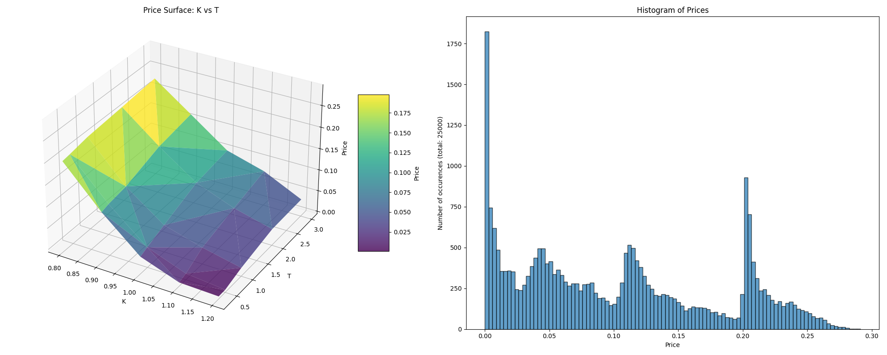
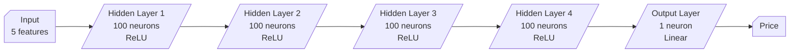
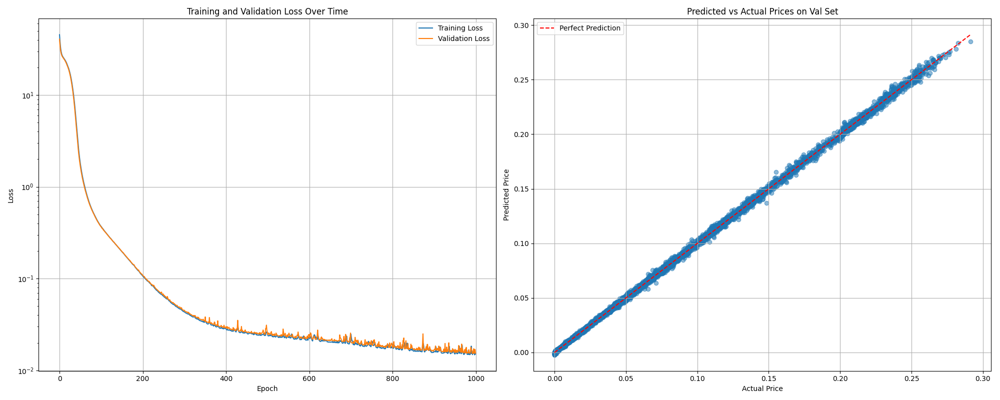

# CUDA Implementation of Nested Monte Carlo for Log-Variance-Gamma Model

A high-performance implementation of the Log-Variance-Gamma model using CUDA for accelerated Monte Carlo simulations, developed as part of the ENSAE GPU Programming course taught by [Lokmane Abbas Turki](https://www.ensae.fr/en/faculty/4113-lokmane-abbas-turki).

<div align="center">
  
  &nbsp;&nbsp;&nbsp;&nbsp;
  
</div>

## Table of Contents
- [Overview](#overview)
- [Project Structure](#project-structure)
- [Installation](#installation)
- [Technical Implementation](#technical-implementation)
  - [Gamma Distribution Generators](#gamma-distribution-generators)
  - [Monte Carlo Simulation](#monte-carlo-simulation)
  - [Neural Network Training](#neural-network-training)

## Overview

This project implements a nested Monte Carlo simulation for the Log-Variance-Gamma model using CUDA acceleration. The implementation focuses on high-performance computing aspects while maintaining numerical accuracy. Key features include:

- Two efficient gamma variable generation algorithms:
  - Johnk's method
  - Best's method
- GPU-accelerated nested Monte Carlo simulation with optimized memory access patterns
- Neural network training using PyTorch for price approximation

## Project Structure

```plaintext
├── README.md
├── requirements.txt
├── gamma-generators/          # Gamma distribution generators
│   ├── best.cu                # Best's method implementation
│   └── johnk.cu               # Johnk's method implementation
├── monte-carlo/               # Monte Carlo simulation
│   ├── simulation.cu          # Nested Monte Carlo implementation
│   └── data/
│       └── vg_prices_all.csv  # Generated dataset
└── pytorch/                   # Neural network implementation
    ├── train.py               # Training script
    └── model.py               # Neural network architecture
    └── visualizations.py      # Script to visualize the dataset
    └── models/
    └── visualizations/
```

## Installation

1. Clone the repository:
```bash
git clone https://github.com/Matt-Olek/CUDA-Log-Variance-Gamma-model.git
cd CUDA-Log-Variance-Gamma-model
```

2. Ensure you have the following dependencies:
- CUDA Toolkit (version 11.0 or higher)
- PyTorch with CUDA support
- Python 3.8 or higher
- Required Python packages (numpy, pandas, matplotlib) see [requirements.txt](./requirements.txt)

## Technical Implementation

### Gamma Distribution Generators

The `gamma-generators/` directory contains two implementations of gamma distribution generators:

- `best.cu`: Best's method implementation
- `johnk.cu`: Johnk's method implementation

Both implementations are coded as `__device__` functions and can be called directly from the Monte Carlo simulation. By default, the simulation uses Johnk's method. To switch to Best's method, modify the import in `simulation.cu` to `#include "../gamma-generators/best.h"` and the function used in the `VG_MC_parallel_kernel` to `gamma_best`.

### Monte Carlo Simulation

The simulation explores a comprehensive parameter space:

> I simulated 10 000 paths, each with 252 steps across a grid of the following parameters:
>
> | Parameter | Values |
> |-----------|--------|
> | Time to maturity **T** | 0.3, 0.5, 1.0, 2.0, 3.0 |
> | Strike price **K** | 0.8, 0.9, 1.0, 1.1, 1.2 |
> | Volatility **σ** | 0.10, 0.12, 0.13, 0.14, 0.15, 0.16, 0.17, 0.18, 0.19, 0.20 |
> | Mean reversion **θ** | -0.34, -0.30, -0.27, -0.24, -0.21, -0.25, -0.26, -0.35, -0.40, -0.45 |
> | Mean reversion speed **κ** | 0.11, 0.12, 0.13, 0.14, 0.15, 0.16, 0.17, 0.18, 0.19, 0.20 |

Which gives us a total of : $5 \times 5 \times 10 \times 10 \times 10 = 25000$ different parameters combinations.
When taking into account the number of paths, we get $25000 \times 10000 = 2.5 \times 10^8$ simulations, so a **quarter of a billion simulations**.

#### Memory Optimization Strategy

The implementation uses an advanced memory allocation and indexing approach inspired by the course:

- Each thread handles one parameter combination
- Thread index decomposition using integer division for parameter access
- Results stored in a flat array with 2 values per combination (moments of order 1 and 2)
- Optimized memory access patterns for GPU efficiency

For example, to decompose a thread index into parameter indices:

```c
int idx = 1234; 
int t_idx = idx / (5 * 10 * 10 * 10);  // dim(K) * dim(kappa) * dim(theta) * dim(sigma)
idx -= t_idx * (5 * 10 * 10 * 10);
int k_idx = idx / (10 * 10 * 10);      // dim(kappa) * dim(theta) * dim(sigma)
idx -= k_idx * (10 * 10 * 10);
int kappa_idx = idx / (10 * 10);       // dim(theta) * dim(sigma)
idx -= kappa_idx * (10 * 10);
int theta_idx = idx / 10;              // dim(sigma)
int sigma_idx = idx % 10;              
```

This way, close index are stored close to each other in memory, minimizing the time of memory access.

Here's a visualization of how different thread indices map to parameter combinations:

| Parameter | Index 0 | Index 1 | Index 2 | Index 3 | Index 4 | Index 5 | Index 6 | Index 7 | Index 8 | Index 9 | Index 10 | Index 11 | ... | Index 100 | Index 101 | ... | Index 1000 | Index 1001 |
|-----------|---------|---------|---------|---------|---------|---------|---------|---------|---------|---------|----------|----------|-----|-----------|-----------|-----|------------|------------|
| T (5)     | 0.3     | 0.3     | 0.3     | 0.3     | 0.3     | 0.3     | 0.3     | 0.3     | 0.3     | 0.3     | 0.3      | 0.3      | ... | 0.3       | 0.3       | ... | 0.3        | 0.3        |
| K (5)     | 0.8     | 0.8     | 0.8     | 0.8     | 0.8     | 0.8     | 0.8     | 0.8     | 0.8     | 0.8     | 0.8      | 0.8      | ... | 0.8       | 0.8       | ... | **0.9**    | **0.9**    |
| κ (10)    | 0.11    | 0.11    | 0.11    | 0.11    | 0.11    | 0.11    | 0.11    | 0.11    | 0.11    | 0.11    | 0.11     | 0.11     | ... | **0.12**  | **0.12**  | ... | 0.11       | 0.11       |
| θ (10)    | -0.34   | -0.34   | -0.34   | -0.34   | -0.34   | -0.34   | -0.34   | -0.34   | -0.34   | -0.34   | **-0.30** | **-0.30** | ... | -0.34     | -0.34     | ... | -0.34      | -0.34      |
| σ (10)    | 0.10    | **0.12** | **0.13** | **0.14** | **0.15** | **0.16** | **0.17** | **0.18** | **0.19** | **0.20** | 0.10      | **0.12**  | ... | 0.10      | **0.12**  | ... | 0.10       | **0.12**   |

- σ changes every index (0-9)
- θ changes every 10 indices (10-19)
- κ changes every 100 indices (100-199)
- K changes every 1000 indices (1000-1999)
- T changes every 25000 indices

#### Block Sizing

- Threads per block: 256
- Dynamic block count calculation based on parameter combinations
- Formula: `(total_combinations + threadsPerBlock - 1) / threadsPerBlock`

#### Launching the simulation

To re-launch the simulation, use the following command:
```bash
cd monte-carlo
nvcc -o simulation simulation.cu
./simulation
```

The simulation will generate a csv file with the results in the `monte-carlo/data` directory. It will be later be used to train the neural network.

Performance results are saved in the `monte-carlo/data/execution_time.md` file :

> [Click to see the output](./monte-carlo/data/execution_time.md)

An histogram of the prices is generated using the `pytorch/dataset_visualizations.py` script and saved in the `pytorch/visualizations` directory.



> **Heavy Simulation**
> Another simulation configuration is available in the `monte-carlo/simulation_heavy.cu` file. It is a more intensive simulation that uses 100 000 paths per parameter combination and more parameters (144 000 combinations in total).
>
> In the same way, you can re-launch the simulation with the following command:
> ```bash
> cd monte-carlo
> nvcc -o simulation_heavy simulation_heavy.cu
> ./simulation_heavy
> ```
> The results are saved in the `monte-carlo/data/execution_time_heavy.md` file :
> [Click to see the output](./monte-carlo/data/execution_time_heavy.md)

### Neural Network Training

Now that we have a dataset, we can train a neural network to approximate the price of the Log-Variance-Gamma model.

> I used a simple **MLP with 4 hidden layers, and 1 output layer**.
> The model is not very complex, we could have used a more fine-grained approach by using some skipped connections or batch normalization but I decided to keep it 
simple as the class is more about the GPU programming than the model design. The model can be found in the `pytorch/model.py` file and adapted freely.

***



To run the training script, use the following command:

```bash
cd pytorch
python train.py
```

> Warning: The training script will not run if there is no GPU available.
> The assertion `assert torch.cuda.is_available(), "CUDA is not available"` will raise an error if no GPU is available.

#### Training results



***

**Author**: Matthieu Olekhnovitch - [@Matt-Olek](https://github.com/Matt-Olek)
